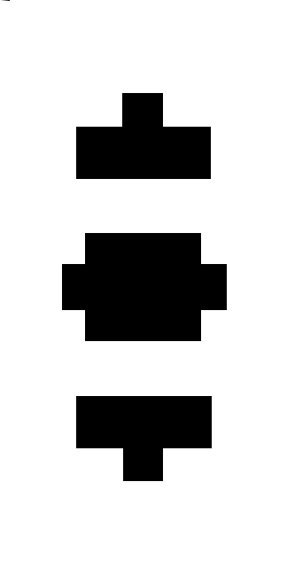

# Pathfinder
A library for generating a set of navigation waypoints.

#### Uses
Pathfinder takes a 2d array or a bitmap image, and create a path to navigate from point *a* to point *b*. It does this by returning an array of pixel locations of every point to get to point *a* to point *b* smoothly.
It can also reduce this path to a path of straight lines.

##### FRC Specific
Pathfinder also has FRC specific implementation for navigating this path. It takes a current location (x, y) and rotation of the robot, and gives back the power for the left and right motors.

#### Creating a MotorOutput for use primarly in FRC.
```Java
WidthImageNodeMap imgMap = new WidthImageNodeMap("images/Picture1.png");
imgMap.setSafeWidth(40);
imgMap.setActualWidth(24);

FRCPathFinder pathfinder = new FRCPathFinder();
pathfinder.setNodeMap(imgMap);

FRCResult result = pathfinder.aStarSearch(new Node(162, 50), new Node(162, 230));

Waypoint[] nodes = result.pathToWaypoints(0);

MotorOutput mtr = new MotorOutput(12, nodes);
```

# How to use pathfinder
There are 3 main components to the library the Map, AStar, and Result.

### Maps / NodeMap
A map object is a form of 2d area where you can return the locations of neighboring nodes, and return whether a node is occupied - Nodes are just a fancy way store x, and y locations of a place on a map.
Maps are stored in the nodemap package.

**HardNodeMap** takes a 2d array of int's from 0-10, 0 a open space, 10 being an occupied space, and 1-9 being how much effort should be put into avoiding that location.

**ImageNodeMap** takes a bitmap image. The first 11 pixels from the left on the top row act as a reference of the 0-10 priority. The left most pixel being 0, the right most (11th) pixel being 10.



You can see the gradient in the top left corner.
A note about image maps, the larger the image the better the pathfinding resolution but the longer it will take, and vice versa.

**WidthImageNodeMap** is the same as image map except that you can pass a width into it. The width is how for away from a location you want to check collision. So if you put in a node and a width of 10 it'll check if there are any collision 10 away from the node. This imitates an object. This class also takes a safe width and actual width. The safe width is the width the path will be generated using. The actual width is the actual width of the object you want to move along the path. Actual width is also used for generating straight line paths.

### AStar / PathFinder
The PathFinder class is what generates the path. The class takes a NodeMap on creation. The class is mainly a shell for aStarSearch, which takes a starting and ending node; where the path will start and end respectively. This method returns a AStarResult object.

### Result / AStarResult
An instance of AStarResult doesn't only hold the raw data from path generation, but it also holds all the methods to make something useful from the raw data.

*makePath* this takes the raw generated path stored in the result class and just returns the actual path as an array of nodes. Position 0 being the start node and the last position being the ending node.

*makeStraightLinePath* takes the path generated from *MakePath* and returns a path made of a the smallest amount of straight lines possible.

*makeStraightLinePath* with a passed in argument of int *actualWidth* constructs a series of straight lines and checks the collision based on actualWidth. Note this only works with a WidthNode map, where the path was generated from a safe width.

### Example
```Java
Pathfinder pathfinder = new Pathfinder();

WidthImageNodeMap imgMap = new WidthImageNodeMap("images/Picture1.png");
imgMap.setSafeWidth(40);
imgMap.setActualWidth(24);

pathfinder.setNodeMap(imgMap);
AStarResult result = pathfinder.aStarSearch(new Node(162, 50), new Node(162, 230));
Node[] path = pathfinder.makePath(result);
Node[] straightLinePath = pathfinder.makeStraightLinePath(path, 24);
```
